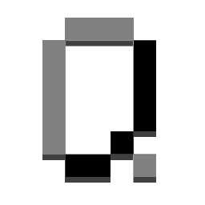

# Keyyyyyyyy

Enables keyboard repeat events on versions before 1.13

## Compatibility

This mod does not have any specific minecraft versions attached, as it only targets LWJGL's keyboard class.
Forge should work down to whatever version LaunchWrapper was implemented (1.6.2?), Fabric may work on all versions.
This mod was tested with 1.8-1.12.2 in the past, so these versions should be considered stable.

|        | Base (LWJGL 2) | Spice (LWJGL 3) | moehreag (LWJGL 3) | Lumen/Lenis (LWJGL 3) |
|--------|:--------------:|:---------------:|:------------------:|:---------------------:|
| Forge  |       ☑️       |       ☑️        |                    |                       |
| Fabric |       ☑️       |                 |         ☑️         |          ☑️           |

